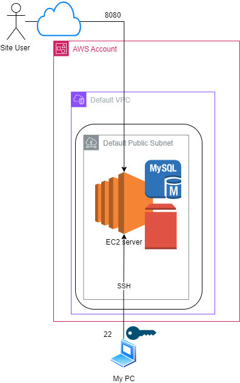

# 🧱 Foundations – Getting Started

A customer with a hosted website approached me to migrate his receipt site to the cloud. As a Cloud Architect, my role was to listen, understand the business needs, and use my AWS toolbox to deliver a modern, secure, scalable solution.

## 1. What Is Cloud Computing?

The first point was to understand some basic concepts in cloud computing so I sent my customer the following Useful links :

- [AWS vs Azure vs GCP](https://www.coursera.org/articles/aws-vs-azure-vs-google-cloud)
- [AWS Free Tier Overview](https://aws.amazon.com/free/)
- Key Concepts: [VPC](https://docs.aws.amazon.com/vpc/), [EC2](https://aws.amazon.com/ec2/), [S3](https://aws.amazon.com/s3/), [RDS](https://aws.amazon.com/rds/), [IAM](https://aws.amazon.com/iam/)

### 🤝 Customer Q&A

**Customer**: *"Isn’t cloud computing just putting your website somewhere else?"*  
**Me**: Not quite. Hosted servers are rented machines. Cloud-native services like AWS manage scaling, availability, security, and automation for you.

**Customer**: *"Which provider should I use?"*  
**Me**: AWS provides the broadest set of mature tools. Azure fits well with Microsoft stacks. GCP excels in analytics and ML.

## 2. Setting Up the AWS Account

- Visit: https://aws.amazon.com/free/
- Create your free account following this [video guide](https://www.youtube.com/watch?v=NbWBE4Mh-tI)
- After logging into the AWS Console:
  - Enable MFA
  - Follow IAM best practices
  - Create your first user and group

# ⚡ Quick Proof of Concept

## 3. "I want to see it work."

- Launch quickly, iterate fast
- Show small wins to build trust

## 4. Designing a Minimal Viable Architecture

**Key components**:

- **EC2 instance**: Hosts the Flask web app and MySQL
- **Static file storage**: Uses EBS
- **Database**: MySQL on the same EC2 instance
- **Site Users**: Connect directly to the server using external IP
- **Developer**: Connect directly to the server using SSH and Symetrical key




## 5. Provision the EC2 Environment

- Use default VPC and subnet for speed
- Launch EC2 (Amazon Linux 2023)
- Create a key pair
- Enable inbound ports 22 (SSH), 8080 (Flask)

## 6. Connect and Set Up Flask

### SSH into EC2

```bash
ssh -i "ReceiptsEC2.pem" ec2-user@<Public IP>
```

### Install Python and Flask

```bash
sudo dnf update -y
sudo dnf install -y python3 git
pip3 install flask pymysql
```

### Create Project Structure

```bash
mkdir ~/recipes-site && cd ~/recipes-site
mkdir -p static/uploads templates
nano app.py
```

Paste the provided Flask `app.py` code and `index.html` accordingly.

## 7. Set Up the Database (MySQL)

### Install MySQL Server

```bash
sudo rpm --import https://repo.mysql.com/RPM-GPG-KEY-mysql-2022
sudo dnf install -y mysql-community-server --nogpgcheck
sudo systemctl start mysqld
sudo systemctl enable mysqld
```

### Secure MySQL

```bash
sudo grep 'temporary password' /var/log/mysqld.log
sudo mysql_secure_installation
```

### Create DB and Table

```sql
CREATE DATABASE recipes_db;
USE recipes_db;
CREATE TABLE recipe_images (
    id INT AUTO_INCREMENT PRIMARY KEY,
    filename VARCHAR(255) NOT NULL,
    title VARCHAR(255),
    upload_time TIMESTAMP DEFAULT CURRENT_TIMESTAMP
);
```

✅ Flask is now fully integrated with MySQL.

Now test the solution:  
Open a browser to `http://<ServerIP>:8080` and upload your first recipe image.

## ✅ Summary and Key Resources

### What We Achieved

- 🧠 Understood cloud basics & AWS services
- 🔐 Created a secure AWS account
- 🚀 Launched and configured an EC2 instance
- 🐍 Deployed a Flask web app with image upload
- 🛢️ Installed MySQL and connected it to Flask

### Recommended AWS References

- [AWS Free Tier](https://aws.amazon.com/free/)
- [Amazon EC2](https://aws.amazon.com/ec2/)
- [Amazon RDS](https://aws.amazon.com/rds/)
- [VPC Overview](https://docs.aws.amazon.com/vpc/)
- [Flask Docs](https://flask.palletsprojects.com/)
- [MySQL 8.0 Reference Manual](https://dev.mysql.com/doc/refman/8.0/en/)

➡️ In the next article: we'll learn how to do the same deployment much quicker using Infrastructure as Code (IAC).
